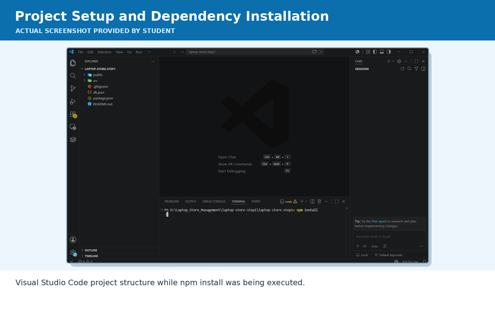
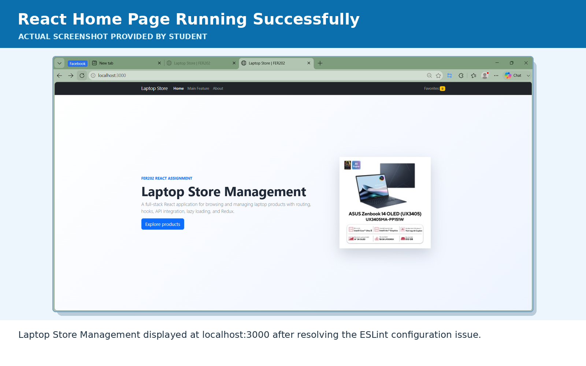
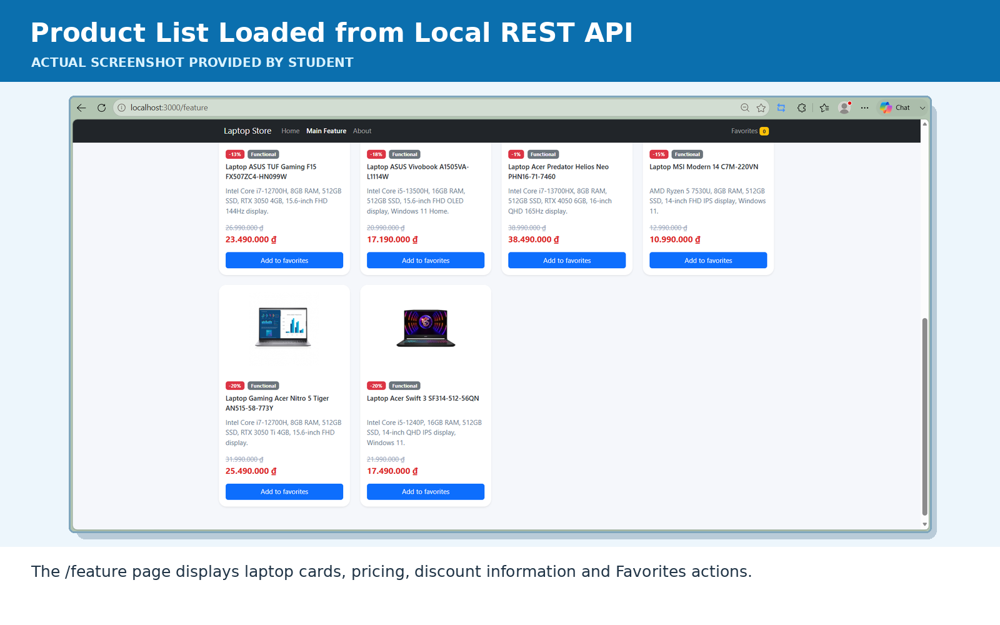
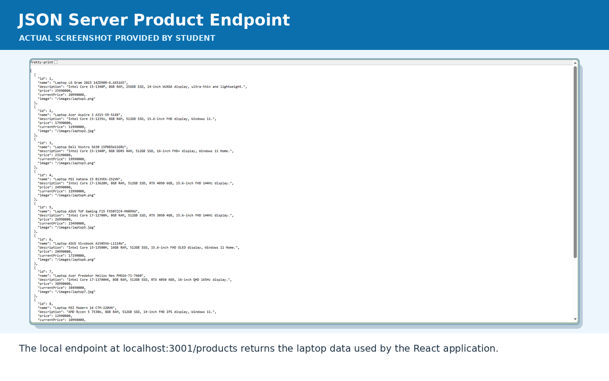
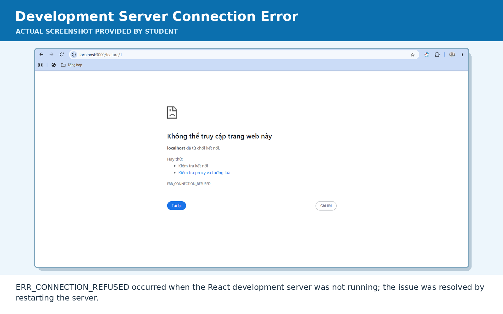
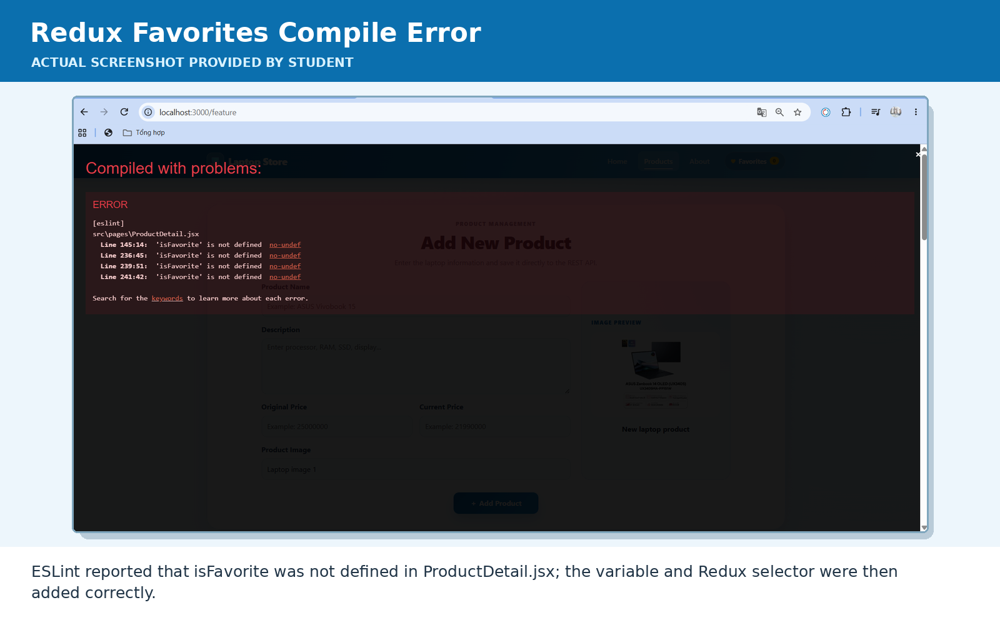
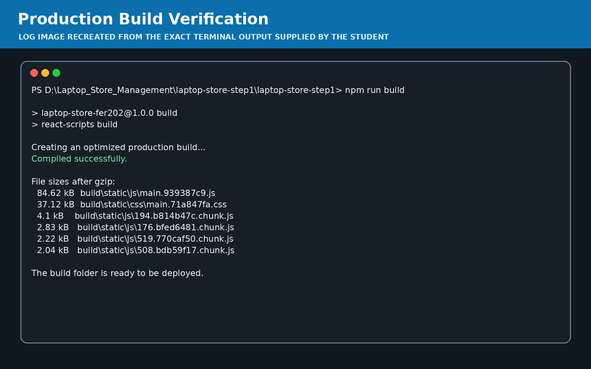
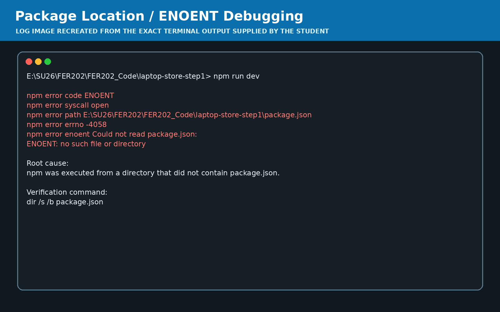

# AI Audit Log


## 1. Thông tin chung

| Thông tin | Nội dung |
|---|---|
| Môn học | Front-End Web Development with React |
| Mã môn học | FER202 |
| Lớp | SE20A04 |
| Học kỳ | SU26 |
| Tên bài tập / Project | Custom React Web Application – Laptop Store Management |
| Tên sinh viên / Nhóm | Huỳnh Thị Thùy Trang |
| MSSV / Danh sách MSSV | DE190387 |
| Giảng viên hướng dẫn | Nguyễn Quang Tuyến |
| Ngày bắt đầu | 17/07/2026 |
| Ngày hoàn thành | 20/07/2026 |

---

## 2. Công cụ AI đã sử dụng

Đánh dấu các công cụ AI đã sử dụng trong quá trình thực hiện bài tập/project.

- [x] ChatGPT
- [x] Gemini
- [x] Claude
- [x] GitHub Copilot
- [ ] Cursor
- [ ] Antigravity
- [ ] Perplexity
- [ ] Microsoft Copilot
- [ ] Công cụ khác: [Điền nếu có]

---

## 3. Mục tiêu sử dụng AI

- Phân tích yêu cầu Assignment và đối chiếu Learning Outcomes LO1–LO8
- Lựa chọn ý tưởng phù hợp cho ứng dụng React
- Xây dựng cấu trúc thư mục và kiến trúc component
- Thiết lập React Router, React-Bootstrap và Redux Toolkit
- Xây dựng REST API cục bộ bằng JSON Server
- Viết chức năng hiển thị, thêm, sửa, xóa và tìm kiếm laptop
- Xây dựng Product Detail và Edit Product
- Tích hợp public API và xử lý loading/error state
- Thiết kế giao diện responsive theo hình tham khảo
- Debug lỗi npm, ESLint, route, Redux và biến chưa khai báo
- Kiểm tra production build
- Hướng dẫn đóng gói ZIP, chia sẻ project và chuẩn bị Git

### Mô tả mục tiêu sử dụng AI

```text
Sử dụng AI để hỗ trợ phân tích yêu cầu và xây dựng ứng dụng Laptop Store Management
cho môn FER202. Ứng dụng cho phép người dùng xem danh sách laptop, tìm kiếm sản phẩm,
thêm sản phẩm mới, xem chi tiết, chỉnh sửa, xóa sản phẩm và quản lý danh sách yêu thích.

AI được sử dụng để gợi ý cấu trúc project, component, routing, Redux state, REST API,
giao diện responsive, xử lý lỗi và quy trình kiểm thử. Sinh viên trực tiếp tạo file,
chạy lệnh, kiểm tra kết quả, phát hiện lỗi, sửa code, đánh giá giao diện và xác nhận
các chức năng hoạt động trước khi nộp.
```

---

## 4. Nhật ký sử dụng AI chi tiết


---

### Lần sử dụng AI số 1

| Nội dung | Thông tin |
|---|---|
| Ngày sử dụng | 17/07/2026 |
| Công cụ AI | ChatGPT |
| Mục đích sử dụng | Phân tích yêu cầu Assignment và lập kế hoạch triển khai LO1–LO8 |
| Phần việc liên quan | Requirement Analysis / Project Planning |
| Mức độ sử dụng | Hỗ trợ nhiều |

#### 4.1. Prompt đã sử dụng

```text
Đây là Assignment "Custom React Web Application" của môn FER202.

Hãy phân tích đầy đủ yêu cầu LO1–LO8 và đề xuất một đề tài React phù hợp.
Ứng dụng cần có Create React App, Git, Class Component, Functional Component,
JSX/ES6, Bootstrap, React Router, useState/useEffect, public API,
React.lazy/Suspense và Redux Toolkit.

Tôi muốn chọn đề tài Laptop Store Management và cần kế hoạch thực hiện từng bước.
```

#### 4.2. Kết quả AI gợi ý

```text
AI đề xuất xây dựng Laptop Store Management với các chức năng:

- Trang Home giới thiệu ứng dụng
- Trang Products tại route /feature
- Trang About tại route /about
- Product Detail tại /feature/:id
- Edit Product tại /feature/:id/edit
- Hiển thị danh sách laptop từ REST API
- Thêm, sửa, xóa và tìm kiếm sản phẩm
- Functional Product Card và Class Product Card
- Redux Toolkit quản lý Favorites
- Counter Favorites trên Navbar
- Public API cho External Laptop Recommendations
- Loading, error và empty state
- Lazy-load trang Main Feature bằng React.lazy và Suspense
- Responsive UI bằng React-Bootstrap và Custom CSS

AI cũng đề xuất cấu trúc thư mục:
src/components, src/pages, src/features, src/app, src/styles.
```

#### 4.3. Phần sinh viên đã sử dụng từ AI

```text
Sử dụng kế hoạch triển khai và cấu trúc thư mục làm cơ sở xây dựng project.

Chọn Laptop Store Management làm chủ đề chính.
Ánh xạ từng yêu cầu LO1–LO8 với component và chức năng cụ thể.
Xác định các route, API endpoint và chức năng CRUD cần triển khai.
```

#### 4.4. Phần sinh viên tự chỉnh sửa hoặc cải tiến

```text
Điều chỉnh đề tài theo bộ dữ liệu 10 laptop và hình ảnh được cung cấp.

Bổ sung:
- Giao diện Home có laptop showcase
- Product Detail hiển thị phần trăm giảm giá và số tiền tiết kiệm
- Favorites Offcanvas
- Tổng giá trị Favorites
- Form preview hình ảnh
- Search theo cả tên và mô tả
- Trang 404 tùy chỉnh

Giữ route /feature theo đúng yêu cầu Assignment, dù menu hiển thị là Products.
```

#### 4.5. Minh chứng

| Loại minh chứng | Nội dung |
|---|---|
| Link commit | https://github.com/Thuy-Chang/ThuyTrang_FER202 |
| File liên quan | `README.md`, `src/App.js`, cấu trúc thư mục `src/` |
| Screenshot | `evidence/screenshots/01_project_setup_npm_install.png`, `evidence/screenshots/02_home_page_running.png` |
| Kết quả chạy/test | Xác định đầy đủ chức năng tương ứng LO1–LO8 |
| Link video demo | `evidence/video/laptop_store_ai_audit_evidence.mp4` |
| Ghi chú khác | Giai đoạn phân tích và lập kế hoạch |

#### 4.6. Nhận xét cá nhân

```text
AI giúp chuyển yêu cầu LO1–LO8 thành các đầu việc kỹ thuật cụ thể.
Tuy nhiên, sinh viên vẫn cần đọc lại đề để bảo đảm route, component,
API và yêu cầu Git được thực hiện đúng, không chỉ dựa hoàn toàn vào AI.
```

---

### Lần sử dụng AI số 2

| Nội dung | Thông tin |
|---|---|
| Ngày sử dụng | 17/07/2026 |
| Công cụ AI | ChatGPT |
| Mục đích sử dụng | Khởi tạo project, cài thư viện và debug lỗi ESLint |
| Phần việc liên quan | Project Setup / Environment Configuration |
| Mức độ sử dụng | Hỗ trợ critical |

#### 4.1. Prompt đã sử dụng

```text
Tôi đã chạy npm install thành công nhưng khi chạy npm run dev,
React không compile và báo lỗi:

[eslint] package.json » eslint-config-react-app/jest#overrides[0]:
Environment key "jest/globals" is unknown

Hãy phân tích nguyên nhân và hướng dẫn sửa từng bước,
không làm ảnh hưởng các chức năng đang có.
```

#### 4.2. Kết quả AI gợi ý

```text
AI xác định lỗi đến từ cấu hình ESLint trong package.json,
không phải lỗi JSX hoặc logic React.

AI đề xuất thay:

"eslintConfig": {
  "extends": [
    "react-app",
    "react-app/jest"
  ]
}

thành:

"eslintConfig": {
  "extends": ["react-app"]
}

Sau đó chạy riêng:
npm start

Khi frontend compile thành công, mở Terminal thứ hai và chạy:
npm run server
```

#### 4.3. Phần sinh viên đã sử dụng từ AI

```text
Sửa cấu hình eslintConfig trong package.json.
Chạy lại npm start và xác nhận React hiển thị tại localhost:3000.
Chạy JSON Server tại localhost:3001.
Kiểm tra endpoint /products trả về dữ liệu JSON.
```

#### 4.4. Phần sinh viên tự chỉnh sửa hoặc cải tiến

```text
Sinh viên trực tiếp kiểm tra Terminal, chụp kết quả và xác nhận:

- npm install hoàn tất
- React compile thành công
- JSON Server hoạt động
- Trang Home hiển thị
- Trang /feature gọi được API

Không chạy npm audit fix --force để tránh breaking changes.
```

#### 4.5. Minh chứng

| Loại minh chứng | Nội dung |
|---|---|
| Link commit | https://github.com/Thuy-Chang/ThuyTrang_FER202 |
| File liên quan | `package.json`, `package-lock.json`, `.gitignore` |
| Screenshot | `evidence/screenshots/01_project_setup_npm_install.png`, `evidence/screenshots/02_home_page_running.png` |
| Kết quả chạy/test | `npm start` và `npm run server` hoạt động |
| Link video demo | `evidence/video/laptop_store_ai_audit_evidence.mp4` |
| Ghi chú khác | Debug môi trường Create React App |

#### 4.6. Nhận xét cá nhân

```text
Qua lỗi này, sinh viên hiểu rằng lỗi compile có thể đến từ cấu hình package
chứ không nhất thiết đến từ code component. Việc đọc chính xác dòng lỗi
trong Terminal giúp tránh sửa nhầm code React.
```

---

### Lần sử dụng AI số 3

| Nội dung | Thông tin |
|---|---|
| Ngày sử dụng | 18/07/2026 |
| Công cụ AI | ChatGPT |
| Mục đích sử dụng | Thiết kế lại Navbar, Home và Product UI theo giao diện tham khảo |
| Phần việc liên quan | Frontend UI/UX Design |
| Mức độ sử dụng | Hỗ trợ nhiều |

#### 4.1. Prompt đã sử dụng

```text
Tôi muốn giao diện Laptop Store follow theo các ảnh tham khảo:
Navbar màu xanh, Home có phần giới thiệu và các laptop nổi bật,
trang Products có form Add Product và danh sách sản phẩm.
Giao diện có thể đẹp và hiện đại hơn mẫu.

Hãy hướng dẫn sửa từng file cụ thể và vẫn giữ đúng yêu cầu FER202.
```

#### 4.2. Kết quả AI gợi ý

```text
AI đề xuất:

- Navbar gradient màu xanh
- Menu Home, Products, About
- Favorites counter trên Navbar
- Hero section với title, description, action buttons
- Laptop showcase dạng grid
- Product page có panel Add New Product
- Product card bo góc, hover animation, giá cũ và giá hiện tại
- Responsive layout theo Bootstrap breakpoint
- Custom CSS sử dụng CSS variables
```

#### 4.3. Phần sinh viên đã sử dụng từ AI

```text
Cập nhật:
- src/components/AppNavbar.jsx
- src/pages/Home.jsx
- src/styles/custom.css

Sử dụng React-Bootstrap Container, Row, Col, Button, Navbar và Badge.
Sử dụng map để render danh sách laptop preview.
```

#### 4.4. Phần sinh viên tự chỉnh sửa hoặc cải tiến

```text
Sinh viên lựa chọn ảnh laptop phù hợp từ dữ liệu được cung cấp.
Kiểm tra kích thước ảnh, độ cân đối của card và responsive.
Yêu cầu bổ sung nút Edit sau khi phát hiện card mới chỉ có
View Details, Favorite và Delete.

Điều chỉnh thiết kế theo phản hồi trực tiếp khi chạy trên trình duyệt.
```

#### 4.5. Minh chứng

| Loại minh chứng | Nội dung |
|---|---|
| Link commit | https://github.com/Thuy-Chang/ThuyTrang_FER202 |
| File liên quan | `src/components/AppNavbar.jsx`, `src/pages/Home.jsx`, `src/styles/custom.css` |
| Screenshot | `evidence/screenshots/02_home_page_running.png`, `evidence/screenshots/03_product_list_api_data.png` |
| Kết quả chạy/test | Responsive trên desktop/mobile, không tràn layout |
| Link video demo | `evidence/video/laptop_store_ai_audit_evidence.mp4` |
| Ghi chú khác | UI/UX và Bootstrap |

#### 4.6. Nhận xét cá nhân

```text
AI giúp tạo nhanh một giao diện nền hiện đại, nhưng sinh viên cần xem trực tiếp
trên trình duyệt để điều chỉnh khoảng cách, hình ảnh và các nút chức năng.
Thiết kế đẹp phải đi kèm khả năng sử dụng và responsive.
```

---

### Lần sử dụng AI số 4

| Nội dung | Thông tin |
|---|---|
| Ngày sử dụng | 18/07/2026 |
| Công cụ AI | ChatGPT |
| Mục đích sử dụng | Xây dựng Product CRUD, Product Detail và Edit Product |
| Phần việc liên quan | React Development / REST API |
| Mức độ sử dụng | Hỗ trợ nhiều |

#### 4.1. Prompt đã sử dụng

```text
Hãy xây dựng bước tiếp theo cho Laptop Store:

- Form Add Product
- POST sản phẩm vào JSON Server
- Delete Product bằng DELETE request
- Product Detail theo ID
- Edit Product bằng PUT request
- React Router cho /feature/:id và /feature/:id/edit
- Loading, error và validation

Hướng dẫn từng file để tôi có thể chạy và test.
```

#### 4.2. Kết quả AI gợi ý

```text
AI cung cấp cấu trúc và code gợi ý cho:

- ProductForm.jsx
- ProductCardFunctional.jsx
- ProductCardClass.jsx
- ProductList.jsx
- ProductDetail.jsx
- EditProduct.jsx
- App.js

REST API:
GET    /products
GET    /products/:id
POST   /products
PUT    /products/:id
DELETE /products/:id

Các trạng thái:
- loading
- fetchError
- validationError
- updateError
- submitting
- deletingId
- feedback

Các validation chính:
- Name không được rỗng
- Description không được rỗng
- Giá phải lớn hơn 0
- Current Price không được lớn hơn Original Price
```

#### 4.3. Phần sinh viên đã sử dụng từ AI

```text
Tạo form thêm laptop và gửi POST request.
Tạo nút Delete và hộp thoại xác nhận.
Tạo route Product Detail.
Tạo form Edit và gửi PUT request.
Hiển thị thông báo thành công hoặc lỗi.
Kiểm tra dữ liệu được lưu trong db.json.
```

#### 4.4. Phần sinh viên tự chỉnh sửa hoặc cải tiến

```text
Sinh viên phát hiện thiếu nút Edit trên Product Card và yêu cầu bổ sung.

Tự kiểm tra:
- Thêm sản phẩm
- Tải lại trang để xác nhận dữ liệu còn tồn tại
- Chỉnh sửa tên/giá
- Kiểm tra endpoint /products/:id
- Xóa sản phẩm test
- Giữ nguyên 10 sản phẩm chính thức

Điều chỉnh bố cục 4 nút:
View Details | Edit
Favorite     | Delete
```

#### 4.5. Minh chứng

| Loại minh chứng | Nội dung |
|---|---|
| Link commit | https://github.com/Thuy-Chang/ThuyTrang_FER202 |
| File liên quan | `ProductForm.jsx`, `ProductList.jsx`, `ProductDetail.jsx`, `EditProduct.jsx`, `db.json` |
| Screenshot | `evidence/screenshots/03_product_list_api_data.png`, `evidence/screenshots/04_json_server_response.png`; cần chụp bổ sung Detail/Edit từ bản final |
| Kết quả chạy/test | POST, GET, PUT, DELETE hoạt động |
| Link video demo | `evidence/video/laptop_store_ai_audit_evidence.mp4` |
| Ghi chú khác | Hoàn thành Activity 1, 2 và 3 |

#### 4.6. Nhận xét cá nhân

```text
Phần CRUD giúp sinh viên hiểu rõ luồng:
UI event -> validate -> fetch request -> API response -> update state -> render lại giao diện.

Cần đặc biệt chú ý kiểu dữ liệu ID, giá tiền và việc đồng bộ dữ liệu
giữa React state với JSON Server.
```

---

### Lần sử dụng AI số 5

| Nội dung | Thông tin |
|---|---|
| Ngày sử dụng | 19/07/2026 |
| Công cụ AI | ChatGPT |
| Mục đích sử dụng | Xây dựng Redux Favorites và debug lỗi isFavorite |
| Phần việc liên quan | Redux Toolkit / Global State / Bug Fix |
| Mức độ sử dụng | Hỗ trợ critical |

#### 4.1. Prompt đã sử dụng

```text
Hãy hoàn thiện LO8 bằng Redux Toolkit:

- Quản lý danh sách sản phẩm yêu thích
- Hiển thị Favorites count trên Navbar
- Mở Offcanvas để xem danh sách
- Xóa từng sản phẩm
- Clear All
- Tính tổng giá trị
- Không cho thêm trùng

Sau khi sửa, project báo:
'isFavorite' is not defined trong ProductDetail.jsx.
Hãy chỉ rõ nguyên nhân và cách sửa.
```

#### 4.2. Kết quả AI gợi ý

```text
AI đề xuất favoritesSlice gồm:
- addFavorite
- removeFavorite
- clearFavorites

FavoritesOffcanvas hiển thị:
- Hình ảnh
- Tên sản phẩm
- Giá
- View
- Remove
- Selected products
- Total value
- Clear All Favorites

Đối với lỗi isFavorite:
AI xác định biến được sử dụng nhưng chưa khai báo đúng scope.

Cách sửa:
- Import useSelector
- Lấy favoriteProducts từ Redux store
- Khai báo isFavorite an toàn khi product còn null
- Chỉ dispatch addFavorite khi sản phẩm chưa tồn tại
```

#### 4.3. Phần sinh viên đã sử dụng từ AI

```text
Tạo FavoritesOffcanvas.jsx.
Chuẩn hóa favoritesSlice.js.
Cập nhật AppNavbar.jsx.
Cập nhật ProductList.jsx và ProductDetail.jsx.
Sửa lỗi isFavorite undefined.
```

#### 4.4. Phần sinh viên tự chỉnh sửa hoặc cải tiến

```text
Sinh viên trực tiếp phát hiện overlay lỗi compile trên trình duyệt
và gửi ảnh lỗi để phân tích.

Sau khi sửa, sinh viên kiểm tra:
- Favorites counter tăng/giảm
- Không thêm trùng
- Remove hoạt động
- Clear All hoạt động
- Tổng giá trị được tính đúng
- Sản phẩm bị Delete khỏi API cũng bị xóa khỏi Favorites
```

#### 4.5. Minh chứng

| Loại minh chứng | Nội dung |
|---|---|
| Link commit | https://github.com/Thuy-Chang/ThuyTrang_FER202 |
| File liên quan | `favoritesSlice.js`, `FavoritesOffcanvas.jsx`, `AppNavbar.jsx`, `ProductDetail.jsx` |
| Screenshot | `evidence/screenshots/06_isfavorite_compile_error.png`; cần chụp bổ sung Favorites Offcanvas từ bản final |
| Kết quả chạy/test | Redux counter, add/remove/clear hoạt động |
| Link video demo | `evidence/video/laptop_store_ai_audit_evidence.mp4` |
| Ghi chú khác | LO8 và debug scope biến |

#### 4.6. Nhận xét cá nhân

```text
Redux phù hợp với dữ liệu cần dùng ở nhiều component như Navbar,
Product List và Product Detail.

Lỗi isFavorite cho thấy cần chú ý phạm vi biến và trạng thái bất đồng bộ:
ở lần render đầu tiên, product có thể vẫn là null.
```

---

### Lần sử dụng AI số 6

| Nội dung | Thông tin |
|---|---|
| Ngày sử dụng | 19/07/2026 |
| Công cụ AI | ChatGPT |
| Mục đích sử dụng | Tích hợp public API, lazy loading và xử lý trạng thái |
| Phần việc liên quan | API Integration / Performance |
| Mức độ sử dụng | Hỗ trợ nhiều |

#### 4.1. Prompt đã sử dụng

```text
Ứng dụng hiện đã có JSON Server cho CRUD.
Hãy bổ sung đúng LO7:

- Fetch dữ liệu từ một public API
- Loading state
- Error state
- Retry/Refresh
- React.lazy và Suspense cho Main Feature page
- Không làm ảnh hưởng dữ liệu local
```

#### 4.2. Kết quả AI gợi ý

```text
AI đề xuất dùng DummyJSON category laptops cho khu vực:
External Laptop Recommendations.

Tạo ExternalLaptopSection.jsx với:
- useEffect gọi public API
- AbortController
- loading
- error
- empty state
- nút Refresh API
- hiển thị tối đa 4 laptop

JSON Server tiếp tục chịu trách nhiệm CRUD local.
DummyJSON chỉ dùng để minh chứng public API.

AI cũng đề xuất lazy-load:
- ProductList
- ProductDetail
- EditProduct

bằng React.lazy và Suspense.
```

#### 4.3. Phần sinh viên đã sử dụng từ AI

```text
Tạo ExternalLaptopSection.
Đưa section vào cuối ProductList.
Kiểm tra request public API trong DevTools Network.
Giữ local products và external products tách biệt.
Sử dụng Suspense fallback khi tải route.
```

#### 4.4. Phần sinh viên tự chỉnh sửa hoặc cải tiến

```text
Sinh viên kiểm tra các trường hợp:
- JSON Server hoạt động, public API hoạt động
- JSON Server tắt, external API vẫn có thể hiển thị
- Mất mạng, external section hiển thị lỗi
- Refresh API gọi lại request
- Dữ liệu external không bị ghi vào db.json
```

#### 4.5. Minh chứng

| Loại minh chứng | Nội dung |
|---|---|
| Link commit | https://github.com/Thuy-Chang/ThuyTrang_FER202 |
| File liên quan | `ExternalLaptopSection.jsx`, `ProductList.jsx`, `App.js` |
| Screenshot | Cần chụp bổ sung External Laptop Recommendations từ bản final; API local hiện có tại `evidence/screenshots/04_json_server_response.png` |
| Kết quả chạy/test | Request public API status 200, loading/error hoạt động |
| Link video demo | `evidence/video/laptop_store_ai_audit_evidence.mp4` |
| Ghi chú khác | Hoàn thành LO7 |

#### 4.6. Nhận xét cá nhân

```text
Việc tách local API và public API giúp ứng dụng vừa có CRUD thật trong môi trường
development, vừa đáp ứng yêu cầu lấy dữ liệu từ nguồn bên ngoài.

Loading và error state rất quan trọng vì kết nối mạng không phải lúc nào cũng thành công.
```

---

### Lần sử dụng AI số 7

| Nội dung | Thông tin |
|---|---|
| Ngày sử dụng | 20/07/2026 |
| Công cụ AI | ChatGPT |
| Mục đích sử dụng | Hoàn thiện tài liệu, kiểm thử, production build và đóng gói project |
| Phần việc liên quan | Documentation / Testing / Packaging / Git |
| Mức độ sử dụng | Hỗ trợ nhiều |

#### 4.1. Prompt đã sử dụng

```text
Hãy giúp tôi hoàn thiện:

- About page giải thích LO1–LO8
- README.md
- Resource Transparency
- Testing checklist
- npm run build
- Đóng gói ZIP để bạn khác có thể kiểm tra, commit hoặc nộp
- Không chứa node_modules và build
- Giữ .git khi cần bàn giao lịch sử commit

Ngoài ra, khi giải nén project, npm báo ENOENT:
Could not read package.json.
Hãy phân tích nguyên nhân.
```

#### 4.2. Kết quả AI gợi ý

```text
AI đề xuất About page gồm:
- Project Overview
- Features
- LO1–LO8
- Technology Stack
- Resource Transparency
- Student/Team Contribution

README gồm:
- Application concept
- Technology stack
- Installation
- Routes
- API operations
- LO explanations
- Project structure
- Contributions
- Transparency
- Testing checklist

Đối với ENOENT:
AI xác định npm được chạy tại thư mục không chứa package.json.
Cách xử lý:
- Dùng dir /s /b package.json để tìm đúng vị trí
- cd vào đúng thư mục project
- Chỉ chạy npm install tại nơi có package.json
```

#### 4.3. Phần sinh viên đã sử dụng từ AI

```text
Cập nhật About.jsx và README.md.
Chạy npm run build.
Xóa build trước khi đóng gói.
Kiểm tra ZIP không có node_modules.
Tìm đúng thư mục chứa package.json khi chạy bản giải nén.
```

#### 4.4. Phần sinh viên tự chỉnh sửa hoặc cải tiến

```text
Sinh viên trực tiếp chạy production build và xác nhận:

Compiled successfully.
The build folder is ready to be deployed.

Sinh viên kiểm tra lại cấu trúc thư mục sau khi giải nén.
Phát hiện lỗi do chạy npm tại sai folder và sử dụng lệnh tìm package.json.

Trước khi nộp, sinh viên cần tự:
- Điền tên, MSSV, lớp và giảng viên
- Xóa dữ liệu test khỏi db.json
- Kiểm tra git log
- Xác nhận ZIP chứa đúng source
```

#### 4.5. Minh chứng

| Loại minh chứng | Nội dung |
|---|---|
| Link commit | https://github.com/Thuy-Chang/ThuyTrang_FER202 |
| File liên quan | `README.md`, `About.jsx`, `.gitignore`, `package.json` |
| Screenshot | `evidence/screenshots/07_production_build_success.png`, `evidence/screenshots/08_package_json_enoent_debug.png` |
| Kết quả chạy/test | `npm run build` compiled successfully |
| Link video demo | `evidence/video/laptop_store_ai_audit_evidence.mp4` |
| Ghi chú khác | Final review và packaging |

#### 4.6. Nhận xét cá nhân

```text
Một project chạy được trên máy phát triển chưa chắc đã chạy được sau khi nén.
Cần kiểm tra cấu trúc ZIP, package.json, package-lock.json, db.json,
README, src và public trước khi gửi hoặc nộp.

Production build là bước quan trọng để phát hiện lỗi compile cuối cùng.
```

---

## 5. Bảng tổng hợp mức độ sử dụng AI

Đánh dấu mức độ AI hỗ trợ ở từng hạng mục.

| Hạng mục | Không dùng AI | AI hỗ trợ ít | AI hỗ trợ nhiều | AI sinh chính | Ghi chú |
|---|:---:|:---:|:---:|:---:|---|
| Phân tích yêu cầu |  |  | ✓ |  | AI hỗ trợ ánh xạ LO1–LO8 |
| Lựa chọn đề tài |  | ✓ |  |  | Sinh viên chọn Laptop Store sau khi tham khảo |
| Thiết kế kiến trúc project |  |  | ✓ |  | AI gợi ý cấu trúc component/page/feature |
| Thiết kế giao diện |  |  | ✓ |  | AI gợi ý CSS, sinh viên chọn ảnh và review UI |
| Code Functional Component |  |  | ✓ |  | AI hỗ trợ ProductCard và các page |
| Code Class Component |  |  | ✓ |  | AI hỗ trợ ProductCardClass |
| React Router |  |  | ✓ |  | AI gợi ý route và lazy loading |
| React Hooks |  |  | ✓ |  | AI hỗ trợ useState/useEffect |
| REST API/CRUD |  |  | ✓ |  | AI hỗ trợ fetch GET/POST/PUT/DELETE |
| Redux Toolkit |  |  | ✓ |  | AI hỗ trợ slice, selectors và Offcanvas |
| Debug lỗi |  |  | ✓ |  | Sinh viên gửi lỗi, AI phân tích, sinh viên áp dụng |
| Viết test case/checklist |  | ✓ |  |  | AI gợi ý, sinh viên test thủ công |
| Kiểm thử sản phẩm | ✓ |  |  |  | Sinh viên trực tiếp chạy và xác nhận |
| Responsive testing | ✓ |  |  |  | Sinh viên kiểm tra trên trình duyệt |
| Viết README/About |  |  | ✓ |  | AI hỗ trợ cấu trúc và nội dung |
| Production build | ✓ |  |  |  | Sinh viên trực tiếp chạy npm run build |
| Đóng gói ZIP |  | ✓ |  |  | AI hướng dẫn, sinh viên thực hiện |
| Git commit/push |  | ✓ |  |  | AI hướng dẫn quy trình, sinh viên thực hiện |

---

## 6. Các lỗi hoặc hạn chế từ AI

Ghi lại các trường hợp AI trả lời sai, thiếu, chưa phù hợp hoặc sinh code chưa chạy ngay.

| STT | Lỗi/hạn chế từ AI | Cách phát hiện | Cách xử lý/cải tiến |
|---:|---|---|---|
| 1 | Bản cấu hình ban đầu có `react-app/jest`, gây lỗi `jest/globals` | Chạy `npm run dev`, React không compile | Xóa `react-app/jest` khỏi `eslintConfig` |
| 2 | Giao diện Product Card ban đầu thiếu nút Edit | Quan sát trang Products sau khi chạy | Bổ sung nút Edit và route `/feature/:id/edit` |
| 3 | Gợi ý cập nhật Product Detail sử dụng `isFavorite` nhưng biến chưa được khai báo đúng scope | React hiển thị overlay lỗi `isFavorite is not defined` | Thêm `useSelector`, khai báo `isFavorite` an toàn khi `product` là null |
| 4 | Hướng dẫn đóng gói có thể tạo nhiều thư mục lồng nhau nếu chọn sai folder nguồn | Giải nén và npm báo không tìm thấy `package.json` | Tìm bằng `dir /s /b package.json`, sửa lại cấu trúc ZIP |
| 5 | Code AI cần được đối chiếu với phiên bản package thực tế | Lỗi import, route hoặc API khi compile/chạy | Kiểm tra `package.json`, đọc Terminal và sửa theo project thực tế |
| 6 | UI do AI đề xuất chưa chắc phù hợp mọi kích thước màn hình | Test responsive bằng DevTools | Điều chỉnh grid, padding, font-size và button layout |
| 7 | AI không tự xác nhận dữ liệu đã ghi đúng vào `db.json` | Reload trang hoặc mở endpoint API | Sinh viên kiểm tra POST/PUT/DELETE và dữ liệu sau reload |

---

## 7. Kiểm chứng kết quả AI

Mô tả cách sinh viên/nhóm kiểm tra lại kết quả do AI gợi ý.

Có thể bao gồm:

- Chạy thử chương trình
- Kiểm tra từng route
- Kiểm tra REST API
- Kiểm tra Redux state
- Kiểm tra validation
- Kiểm tra loading/error
- Kiểm tra responsive
- Kiểm tra Console và Network
- Chạy production build
- Giải nén ZIP và chạy lại project
- Review cùng bạn học
- Đối chiếu với LO1–LO8

### Nội dung kiểm chứng

```text
Phương pháp kiểm chứng được sử dụng:

1. Chạy npm install để cài dependencies.
2. Chạy npm start để kiểm tra React frontend.
3. Chạy npm run server để kiểm tra JSON Server.
4. Chạy npm run dev để kiểm tra hai server hoạt động đồng thời.
5. Mở http://localhost:3000 và kiểm tra trang Home.
6. Mở /feature và kiểm tra danh sách laptop.
7. Kiểm tra Add Product bằng POST request.
8. Reload trình duyệt để xác nhận dữ liệu được lưu trong db.json.
9. Kiểm tra Product Detail bằng route /feature/:id.
10. Kiểm tra Edit Product và PUT request.
11. Kiểm tra Delete Product và DELETE request.
12. Kiểm tra search theo tên và mô tả.
13. Kiểm tra validation form với dữ liệu rỗng, giá 0 và giá không hợp lệ.
14. Kiểm tra Favorites counter, add, remove và clear.
15. Kiểm tra không thêm trùng Favorites.
16. Kiểm tra tổng giá trị Favorites.
17. Kiểm tra Public API trong DevTools Network.
18. Kiểm tra loading, error và empty state.
19. Kiểm tra route /about và trang 404.
20. Kiểm tra giao diện ở desktop, tablet và mobile.
21. Kiểm tra Console không có lỗi JavaScript nghiêm trọng.
22. Chạy npm run build và xác nhận Compiled successfully.
23. Xóa node_modules/build khỏi bản ZIP.
24. Giải nén ZIP ở thư mục khác, chạy lại npm install và npm run dev.
25. Review project cùng bạn học trước khi commit/push/nộp.

Kết quả:
- React frontend chạy thành công.
- JSON Server trả về product data.
- CRUD hoạt động.
- Redux Favorites hoạt động.
- Public API hoạt động.
- Production build thành công.
- Các lỗi phát hiện trong quá trình phát triển đã được sửa.
```

---

## 8. Đóng góp cá nhân hoặc đóng góp nhóm

### 8.1. Đối với bài cá nhân

> Tỉ lệ dưới đây là bản nháp tham khảo. Sinh viên cần điều chỉnh lại theo đúng mức độ thực tế trước khi nộp.

```text
**Phần tôi tự làm (35%):**
- Đọc yêu cầu Assignment và lựa chọn đề tài Laptop Store
- Thực hiện các bước tạo/sửa file trong Visual Studio Code
- Chuẩn bị dữ liệu và ảnh laptop
- Chạy npm install, npm start, npm run server và npm run dev
- Quan sát giao diện và yêu cầu điều chỉnh
- Phát hiện thiếu nút Edit
- Phát hiện lỗi ESLint và lỗi isFavorite
- Test Add, Detail, Edit, Delete và Favorites
- Kiểm tra API trong trình duyệt
- Chạy production build
- Kiểm tra và đóng gói project

**Phần AI hỗ trợ (45%):**
- Phân tích yêu cầu LO1–LO8
- Gợi ý cấu trúc project và component
- Gợi ý code React Router
- Gợi ý Functional/Class Component
- Gợi ý Product CRUD
- Gợi ý Redux Favorites
- Gợi ý Public API và lazy loading
- Gợi ý CSS responsive
- Phân tích lỗi và đề xuất cách sửa
- Hỗ trợ viết README/About/AI Audit Log
- Hướng dẫn Git và đóng gói ZIP

**Phần tôi tự chỉnh sửa, kiểm chứng và cải tiến từ gợi ý AI (20%):**
- Lựa chọn nội dung và giao diện phù hợp với đề bài
- Điều chỉnh hình ảnh, tên sản phẩm và bố cục
- Bổ sung nút Edit khi phát hiện thiếu
- Áp dụng fix theo lỗi thực tế trong Terminal
- Xóa dữ liệu test
- Kiểm tra lại từng chức năng sau khi sửa
- Xác nhận build thành công
- Chuẩn hóa bản ZIP trước khi gửi/nộp
```

### 8.2. Đối với bài nhóm

| Thành viên | MSSV | Nhiệm vụ chính | Có sử dụng AI không? | Minh chứng đóng góp |
|---|---|---|---|---|
| [Thành viên 1] | [MSSV] | Project setup, routing, Home/About | Có / Không | Commit, screenshot |
| [Thành viên 2] | [MSSV] | Product List, Add/Delete | Có / Không | Commit, API test |
| [Thành viên 3] | [MSSV] | Product Detail, Edit Product | Có / Không | Commit, video demo |
| [Thành viên 4] | [MSSV] | Redux Favorites, Public API | Có / Không | Commit, screenshot |
| [Thành viên 5] | [MSSV] | CSS, testing, README, packaging | Có / Không | Commit, build log |

---

## 9. Reflection cuối bài

### 9.1. AI đã hỗ trợ em/nhóm ở điểm nào?

```text
AI hỗ trợ nhiều ở các công đoạn:

1. Phân tích yêu cầu:
   Chuyển LO1–LO8 thành danh sách component và chức năng cụ thể.

2. Lập kế hoạch:
   Chia project thành từng bước nhỏ để dễ thực hiện và kiểm tra.

3. Code generation:
   Gợi ý code mẫu cho component, route, form, API và Redux.

4. UI/UX:
   Gợi ý bố cục Home, Navbar, Product Card, Product Detail và Favorites.

5. Debug:
   Giúp đọc lỗi ESLint, route, server và biến isFavorite.

6. API:
   Gợi ý cách dùng JSON Server cho CRUD và public API cho LO7.

7. Documentation:
   Hỗ trợ viết README, About page, test checklist và AI Audit Log.

8. Packaging:
   Hướng dẫn loại bỏ node_modules/build và kiểm tra package.json.
```

### 9.2. Phần nào em/nhóm không sử dụng theo gợi ý của AI? Vì sao?

```text
1. Không giữ nguyên toàn bộ giao diện AI đề xuất:
   Sinh viên điều chỉnh theo ảnh tham khảo và cảm nhận thực tế.

2. Không chạy npm audit fix --force:
   Vì lệnh này có thể nâng package và làm project bị breaking changes.

3. Không commit ngay sau từng bước:
   Sinh viên muốn hoàn thành và review chức năng trước khi tổ chức commit.
   Tuy nhiên, trước khi nộp vẫn phải đảm bảo tối thiểu 5 commit theo LO1.

4. Không đưa node_modules vào ZIP:
   Vì thư mục này rất lớn và có thể tạo lại bằng npm install.

5. Không đưa build vào bản source review:
   Vì build có thể tạo lại bằng npm run build.

6. Không tin hoàn toàn vào code AI:
   Mỗi phần đều được chạy thử và sửa theo lỗi thực tế.
```

### 9.3. Em/nhóm đã kiểm tra tính đúng đắn của kết quả AI như thế nào?

```text
1. Chạy từng lệnh trong Terminal và đọc output.
2. Kiểm tra React compile thành công.
3. Kiểm tra API bằng trình duyệt và DevTools Network.
4. Thực hiện CRUD bằng dữ liệu test.
5. Reload trang để kiểm tra dữ liệu có được lưu.
6. Kiểm tra Redux counter và danh sách Favorites.
7. Thử thêm trùng, xóa một sản phẩm và clear all.
8. Test route đúng, route sai và URL động.
9. Kiểm tra responsive bằng DevTools.
10. Chạy npm run build.
11. Giải nén project ở thư mục khác và chạy lại.
12. Nhờ bạn học review trước khi nộp.
```

### 9.4. Nếu không có AI, phần nào sẽ khó khăn nhất?

```text
1. Ánh xạ đầy đủ LO1–LO8 vào một project thống nhất.
2. Viết đồng thời Class Component và Functional Component.
3. Thiết lập Redux Toolkit và chia state toàn cục.
4. Xử lý Product Detail/Edit với route parameter.
5. Viết đầy đủ loading, error và validation state.
6. Debug lỗi package/ESLint không liên quan trực tiếp đến JSX.
7. Thiết kế CSS responsive cho nhiều trang.
8. Viết README và AI Audit Log chi tiết.
9. Tổ chức quy trình kiểm thử và đóng gói project.
```

### 9.5. Sau bài tập/project này, em/nhóm học được gì về môn học?

```text
1. Hiểu cấu trúc một React application có nhiều component và page.
2. Biết truyền dynamic data qua props.
3. Phân biệt Class Component và Functional Component.
4. Sử dụng JSX và ES6 để render dữ liệu.
5. Sử dụng React-Bootstrap và Custom CSS.
6. Sử dụng React Router với static route và dynamic route.
7. Sử dụng useState để quản lý form và UI state.
8. Sử dụng useEffect để gọi API.
9. Thực hiện GET, POST, PUT và DELETE request.
10. Xử lý loading, error, empty state và validation.
11. Sử dụng React.lazy và Suspense.
12. Sử dụng Redux Toolkit cho global state.
13. Kiểm tra ứng dụng qua Console, Network và production build.
14. Hiểu vai trò của package.json, package-lock.json và node_modules.
15. Biết đóng gói source code để người khác có thể cài và chạy lại.
```

### 9.6. Sau bài tập/project này, em/nhóm học được gì về cách sử dụng AI có trách nhiệm?

```text
1. AI là công cụ hỗ trợ, không thay thế việc hiểu bài.
2. Cần đọc và giải thích được mọi đoạn code được sử dụng.
3. Không copy-paste mù quáng vì code AI có thể thiếu import hoặc sai scope.
4. Luôn chạy thử và đọc lỗi trong Terminal.
5. Phải kiểm tra dữ liệu sau POST, PUT và DELETE.
6. Cần khai báo minh bạch phần AI hỗ trợ.
7. Không nên ghi nhận công cụ AI chưa thực sự sử dụng.
8. Không nên khẳng định chức năng đã hoàn thành nếu chưa test.
9. Cần giữ lại minh chứng: screenshot, build log và commit.
10. Sinh viên chịu trách nhiệm cuối cùng đối với source code được nộp.
```

---

## 10. Cam kết học thuật

Sinh viên/nhóm cam kết rằng:

- Nội dung AI hỗ trợ đã được ghi nhận trung thực.
- Không nộp nguyên văn kết quả AI mà không kiểm tra.
- Có khả năng giải thích các component, route, hook, API và Redux trong project.
- Đã chạy thử các chức năng chính trước khi nộp.
- Chịu trách nhiệm về tính đúng đắn của sản phẩm cuối cùng.
- Hiểu rằng việc sử dụng AI không khai báo có thể ảnh hưởng đến kết quả đánh giá.
- Sẽ cập nhật đúng tên, MSSV, lớp, giảng viên, ngày hoàn thành và minh chứng trước khi nộp.

| Đại diện sinh viên/nhóm | Ngày xác nhận |
|---|---|
| Huỳnh Thị Thùy Trang – DE190387 | 20/07/2026 |


---

## 11. Phụ lục minh chứng

### 11.1. Project setup và cài đặt thư viện



### 11.2. Trang Home chạy thành công



### 11.3. Danh sách sản phẩm lấy từ REST API



### 11.4. JSON Server endpoint



### 11.5. Minh chứng quá trình debug server



### 11.6. Minh chứng debug Redux Favorites



### 11.7. Production build thành công



### 11.8. Debug lỗi không tìm thấy package.json



### 11.9. Video minh chứng tổng hợp

`evidence/video/laptop_store_ai_audit_evidence.mp4`

### 11.10. Repository

https://github.com/Thuy-Chang/ThuyTrang_FER202

